
<h1 align="center">计算机学院校友网</h1>

## 简介
计算机学院校友网：角色分为管理员和校友用户；提供校友交流、活动发布、公告信息管理、校友招聘、个人信息管理和后台管理功能，支持内容增删改查，增强校友互动与联系。    --计算机毕业设计源码；毕设源码；java毕业设计源码

## 联系方式

<h3 align="center">获取完整代码与数据库文件 + 微信：deepguan QQ: 86050149 QQ群: 783742310</h3>

<h3 align="center">可帮忙远程部署 包运行成功！提供远程部署、修改代码、设计文档指导、代码讲解等服务！</h3>

## 功能介绍（完整见运行截图）
管理员：基本功能包括个人中心、管理员管理、分会管理等。提供活动及文章管理、校友交流管理、活动类型管理等功能，能够查看、修改、删除和新增分会，以及对活动类型进行具体管理与搜索，可管理校友信息，支持详细信息查看、修改、删除等操作。 校友：可访问首页、分会成员、校友活动、公告信息、校友风采等功能模块。拥有个人中心、修改密码、查看个人信息及其他校友信息、校友交流和评论功能。支持参与活动，查看公告和风采内容，也可通过平台进行招聘信息浏览和应聘互动。

## 运行截图
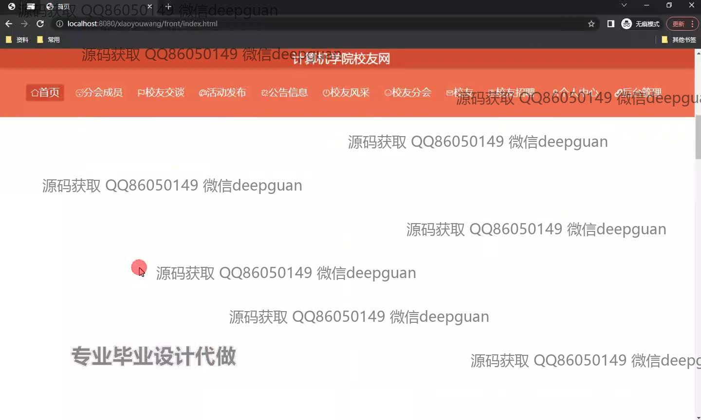
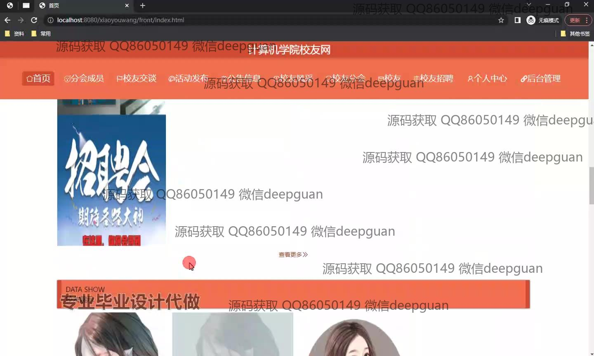
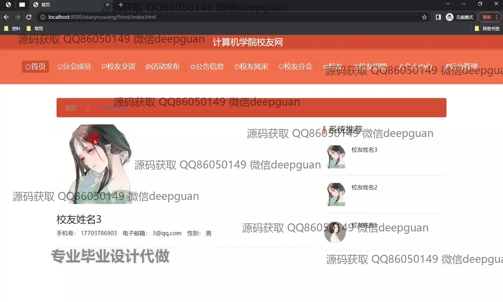
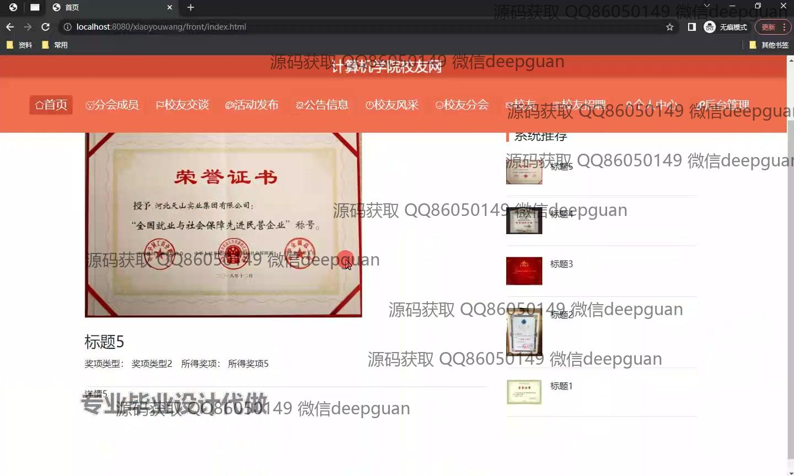
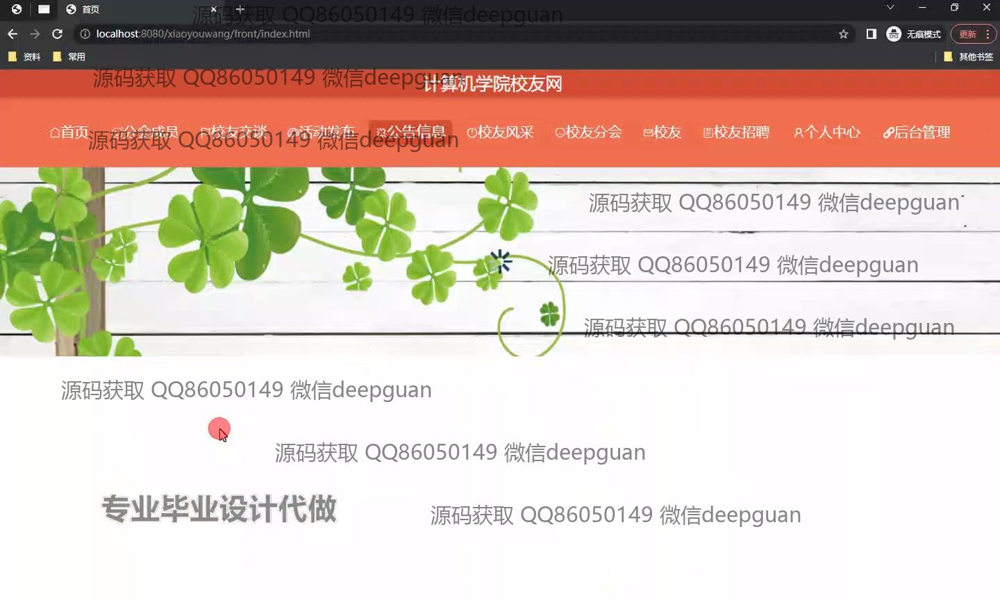
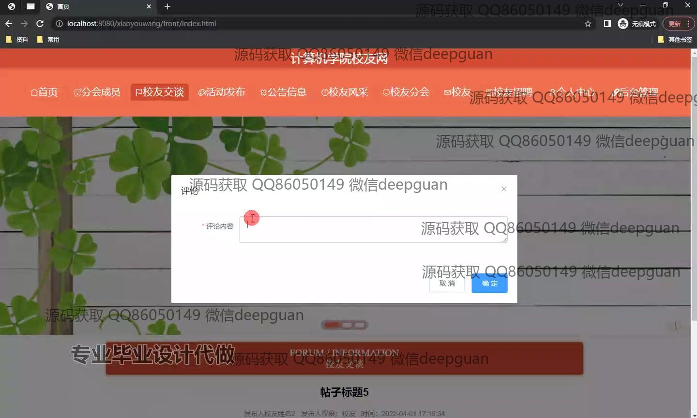
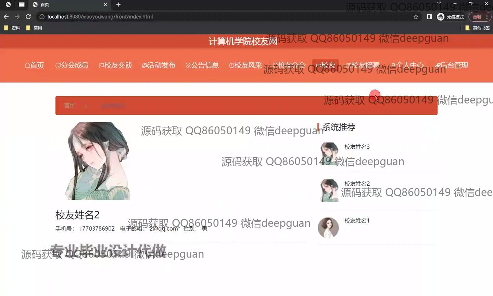
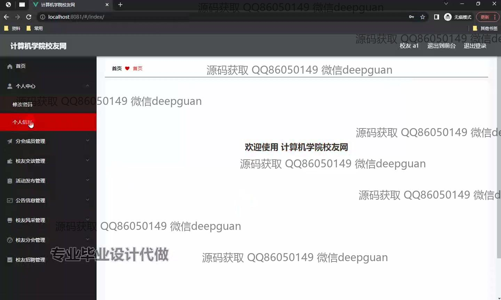
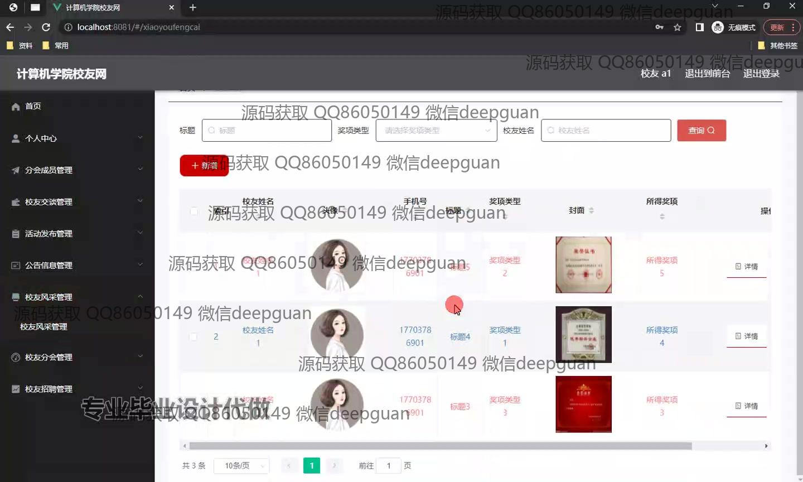
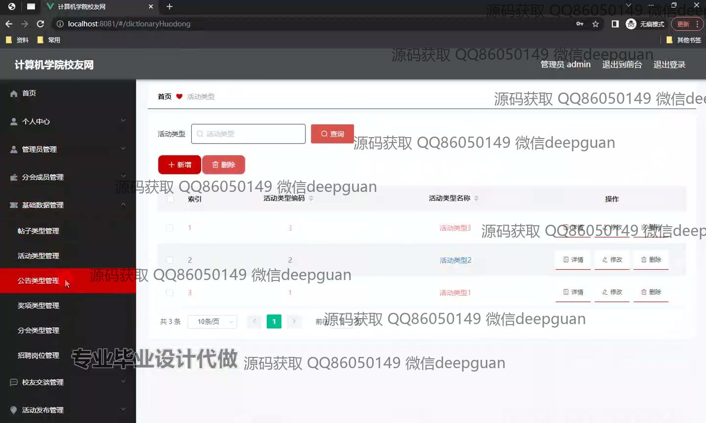
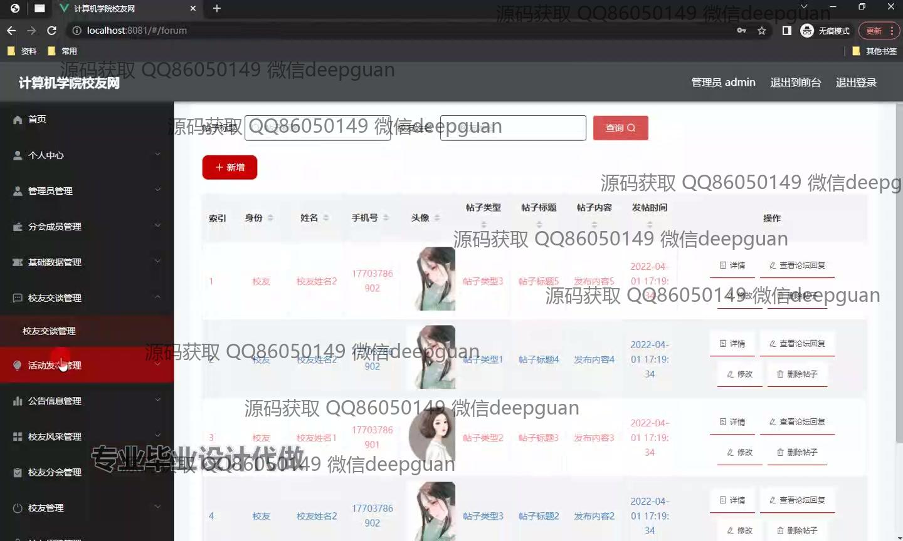
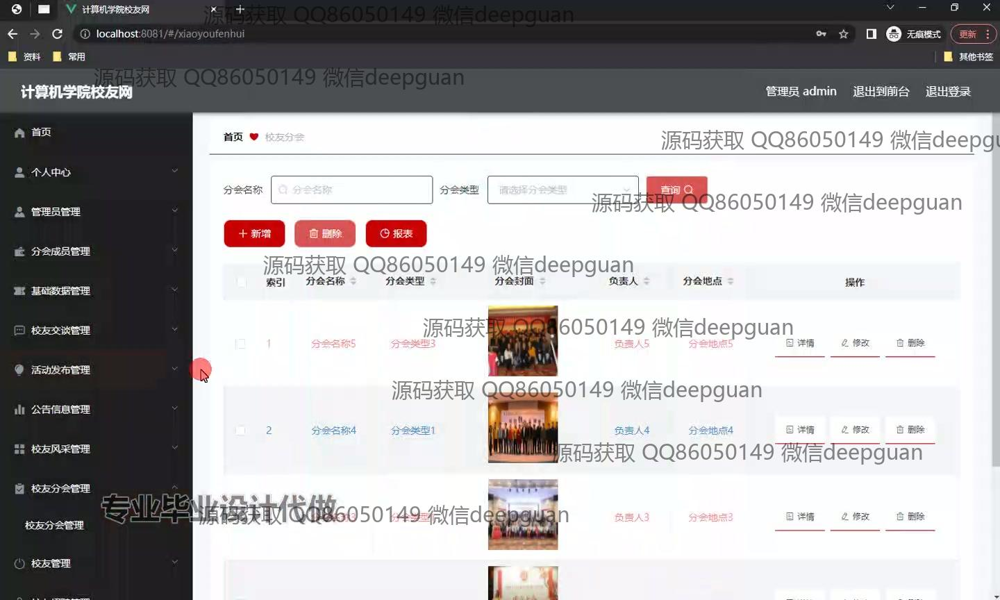

本代码来源于网络,仅供学习参考使用!

